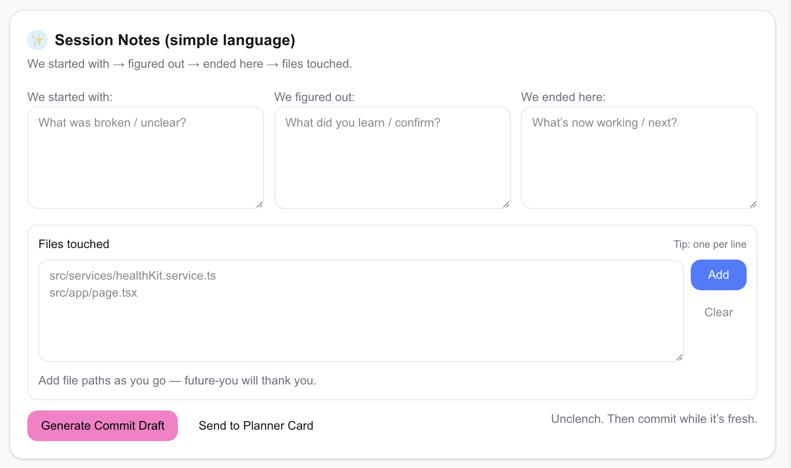
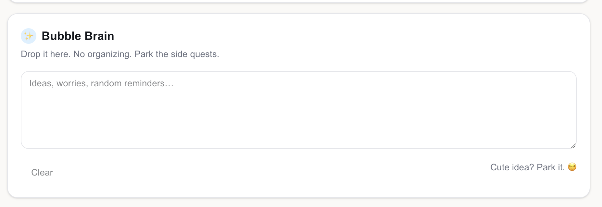
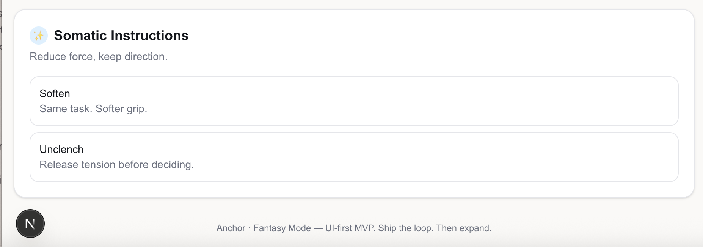

# Anchor · Fantasy Mode 🌸💎

Anchor · Fantasy Mode is a **UI-first personal operating system** designed for people who wear many hats and need clarity without rigidity.

It blends:
- calm structure
- gentle–stern accountability
- somatic regulation
- playful, early-2000s inspired aesthetics

This project prioritizes **focus, follow-through, and nervous-system awareness** over traditional productivity pressure.

---

## ✨ Why Anchor Exists

When you:
- juggle multiple roles
- think faster than tools can keep up
- procrastinate because the scope feels too big
- lose ideas because they arrive at the wrong time

Most systems fail.

Anchor is designed to work *with* how the brain and body actually operate.

---

## 🧠 Core Concepts

### Anchor
A grounding mechanism that limits the day to **three priorities only**.

### Fantasy Mode
A playful internal mode that allows creativity and softness *without sacrificing execution*.

### Bubble Brain
A judgment-free capture space for ideas, worries, and side quests — so they don’t derail focus.

### Somatic Instructions
Short, embodied cues that regulate effort and urgency:
- **Soften** → reduce intensity, keep direction
- **Unclench** → release tension before deciding

---

## 🧩 Current Features (UI-first MVP)

- **Mode Switching**
  - Developer / Founder / Student / Parent / Rest
- **Today’s Anchor**
  - Lock in 3 priorities per day
- **Focus Sprints**
  - Time-boxed work with reflection
  ### Dashboard (Focus + Anchor)

- **Session Notes**
  - Started → Figured Out → Ended Here → Files Touched
  ### Session Notes (Developer Mode)

- **Git Commit Draft Helper**
  - Turns session notes into clear commits
- **Bubble Brain**
  - Capture without organizing
  ### Bubble Brain (Capture)

- **Planner Card**
  - Simplified output designed to be written by hand in a physical planner
  ### Planner Card (Write it down)

### Somatic Instructions

---

## 🛠 Tech Stack

- **Next.js (App Router)**
- **React + TypeScript**
- **Tailwind CSS**
- UI-first architecture (logic evolves after clarity)

---

## 🎨 Visual Direction

Inspired by:
- early-2000s mall airbrush art
- bubble typography
- pink bubblegum + denim blue
- subtle diamond / sparkle accents

Modernized with clean layouts, whitespace, and calm UX.

---

## 🔮 Future Vision

- Voice-first idea capture (cross-device)
- Deeper assistant logic (Anchor voice)
- Optional reminders & automation
- Expanded somatic regulation tools
- Symbolic pattern interrupts (future separate product)

---

## 📌 Philosophy

> Fewer priorities.  
> Clear states.  
> Gentle structure.  
> Finish the loop.

Built with intention by **Alexia** ✨